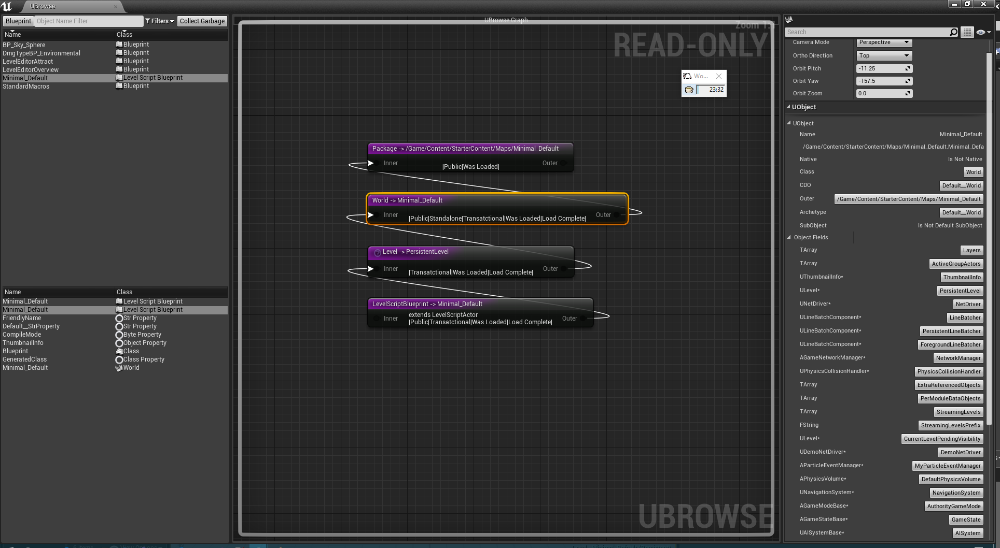

# UBrowse

Unreal Engine plugin for browsing a graph of the low/level package/object structure and UPROPERTY fields of live objects in the engine.

It compiles against Unreal Engine 4.14

It is based in part on the Object Browser plugin by [Nick Darnell] (https://github.com/ue4plugins/ObjectBrowser)
